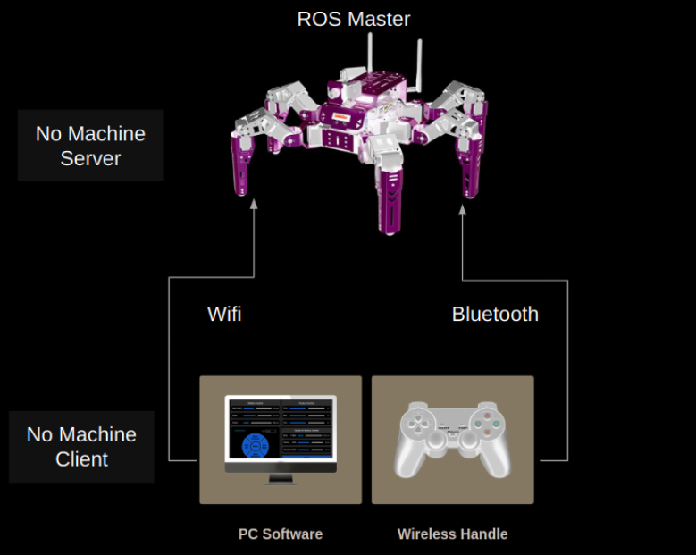
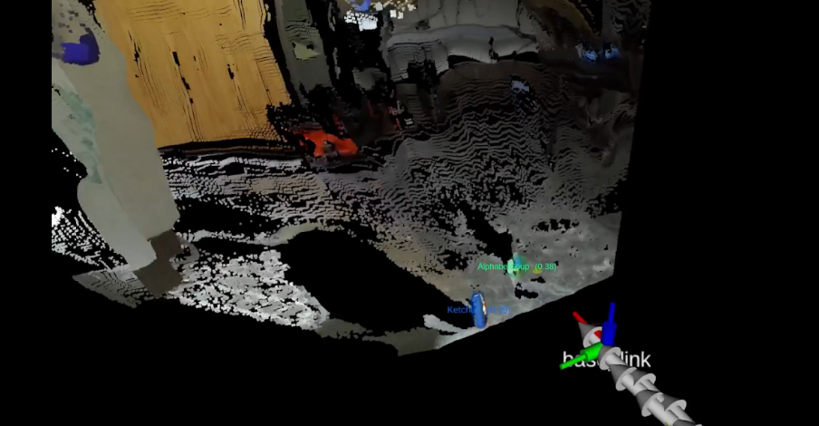

# Jethexa ROS
This repository is part of my class project (Introduction to Autonomous Mobile Systems - EEL 5683) at the Intelligent Systems and Robotics Department at UWF.

## Jethexa Intro
<p align="center">


</p>

## Jethexa Com Structure
<p align="center">

</p>

## Jethexa Sensor 
### Published Topics
```
/jethexa/battery_low_alarm
/jethexa/body_link_to_laser_link
/jethexa/camera/camera_nodelet_manager
/jethexa/camera/depth_metric
/jethexa/camera/depth_metric_rect
/jethexa/camera/depth_points
/jethexa/camera/depth_rectify_depth
/jethexa/camera/depth_registered_sw_metric_rect
/jethexa/camera/driver
/jethexa/camera/points_xyzrgb_sw_registered
/jethexa/camera/register_depth_rgb
/jethexa/camera/rgb_rectify_color
/jethexa/camera/uvc_color
/jethexa/camera_base_link
/jethexa/camera_base_link1
/jethexa/camera_base_link2
/jethexa/camera_base_link3
/jethexa/camera_link_2_base_link_1
/jethexa/ekf_se
/jethexa/jethexa_controller
/jethexa/joystick_control
/jethexa/rf2o_laser_odometry
/jethexa/robot_state_publisher
/jethexa/ydlidar_lidar_g4_publisher
/mapping_rviz
/rosout
```

## Jethexa Mapping
<p align="center">

</p>

### Published Topics
```
/jethexa/cmd_vel
/jethexa/imu/filtered
/jethexa/jethexa_controller/cmd_vel
/jethexa/jethexa_controller/pose_transform_euler
/jethexa/jethexa_controller/run_actionset
/jethexa/jethexa_controller/set_head_absolute
/jethexa/jethexa_controller/set_head_relatively
/jethexa/jethexa_controller/set_leg_absolute
/jethexa/jethexa_controller/set_leg_relatively
/jethexa/jethexa_controller/set_pose
/jethexa/jethexa_controller/set_pose_euler
/jethexa/jethexa_controller/traveling
/jethexa/joint_states
/jethexa/odom/filtered
/jethexa/odom/laser
/jethexa/odom/raw
/jethexa/point_cloud
/jethexa/rtabmap/cloud_ground
/jethexa/rtabmap/cloud_map
/jethexa/rtabmap/cloud_obstacles
/jethexa/rtabmap/global_path
/jethexa/rtabmap/global_path_nodes
/jethexa/rtabmap/global_pose
/jethexa/rtabmap/goal
/jethexa/rtabmap/goal_node
/jethexa/rtabmap/goal_out
/jethexa/rtabmap/goal_reached
/jethexa/rtabmap/gps/fix
/jethexa/rtabmap/grid_prob_map
/jethexa/rtabmap/grid_prob_map_updates
/jethexa/rtabmap/imu
/jethexa/rtabmap/info
/jethexa/rtabmap/initialpose
/jethexa/rtabmap/labels
/jethexa/rtabmap/landmarks
/jethexa/rtabmap/local_grid_empty
/jethexa/rtabmap/local_grid_ground
/jethexa/rtabmap/local_grid_obstacle
/jethexa/rtabmap/local_path
/jethexa/rtabmap/local_path_nodes
/jethexa/rtabmap/localization_pose
/jethexa/rtabmap/mapData
/jethexa/rtabmap/mapGraph
/jethexa/rtabmap/mapOdomCache
/jethexa/rtabmap/mapPath
/jethexa/rtabmap/octomap_binary
/jethexa/rtabmap/octomap_empty_space
/jethexa/rtabmap/octomap_full
/jethexa/rtabmap/octomap_global_frontier_space
/jethexa/rtabmap/octomap_grid
/jethexa/rtabmap/octomap_ground
/jethexa/rtabmap/octomap_obstacles
/jethexa/rtabmap/octomap_occupied_space
/jethexa/rtabmap/proj_map
/jethexa/rtabmap/republish_node_data
/jethexa/rtabmap/scan_map
/jethexa/rtabmap/tag_detections
/jethexa/rtabmap/user_data_async
/jethexa/scan
/jethexa/voltage
/map
/rosout
/rosout_agg
/rtabmap/republish_node_data
/tf
/tf_static
```

## Node List
```
/jethexa/battery_low_alarm
/jethexa/body_link_to_laser_link
/jethexa/camera/camera_nodelet_manager
/jethexa/camera/depth_metric
/jethexa/camera/depth_metric_rect
/jethexa/camera/depth_points
/jethexa/camera/depth_rectify_depth
/jethexa/camera/depth_registered_sw_metric_rect
/jethexa/camera/driver
/jethexa/camera/points_xyzrgb_sw_registered
/jethexa/camera/register_depth_rgb
/jethexa/camera/rgb_rectify_color
/jethexa/camera/uvc_color
/jethexa/camera_base_link
/jethexa/camera_base_link1
/jethexa/camera_base_link2
/jethexa/camera_base_link3
/jethexa/camera_link_2_base_link_1
/jethexa/ekf_se
/jethexa/jethexa_controller
/jethexa/joystick_control
/jethexa/rf2o_laser_odometry
/jethexa/robot_state_publisher
/jethexa/rtabmap/rtabmap
/jethexa/ydlidar_lidar_g4_publisher
/mapping_rviz
/rosout
```
## Jethexa Autonomous Waypoint Navigation

### Transform Tree
<p align="center">

</p>

### Published Topics
```
❯ rostopic list
/diagnostics
/jethexa/camera/camera_connected
/jethexa/camera/camera_disconnected
/jethexa/camera/camera_nodelet_manager/bond
/jethexa/camera/depth/camera_info
/jethexa/camera/depth/image
/jethexa/camera/depth/image/compressed
/jethexa/camera/depth/points
…
/jethexa/camera/rgb/camera_info
/jethexa/camera/rgb/image_raw
…
/jethexa/cmd_vel
/jethexa/imu/filtered
/jethexa/jethexa_controller/cmd_vel
/jethexa/jethexa_controller/pose_transform_euler
/jethexa/jethexa_controller/run_actionset
/jethexa/jethexa_controller/set_head_absolute
/jethexa/jethexa_controller/set_head_relatively
/jethexa/jethexa_controller/set_leg_absolute
/jethexa/jethexa_controller/set_leg_relatively
/jethexa/jethexa_controller/set_pose
/jethexa/jethexa_controller/set_pose_euler
/jethexa/jethexa_controller/traveling
/jethexa/joint_states
/jethexa/move_base/GlobalPlanner/parameter_descriptions
/jethexa/move_base/GlobalPlanner/parameter_updates
/jethexa/move_base/GlobalPlanner/plan
/jethexa/move_base/GlobalPlanner/potential
/jethexa/move_base/TebLocalPlannerROS/costmap_converter/CostmapToLinesDBSRANSAC/parameter_descriptions
/jethexa/move_base/TebLocalPlannerROS/costmap_converter/CostmapToLinesDBSRANSAC/parameter_updates
/jethexa/move_base/TebLocalPlannerROS/global_plan
/jethexa/move_base/TebLocalPlannerROS/local_plan
/jethexa/move_base/TebLocalPlannerROS/obstacles
/jethexa/move_base/TebLocalPlannerROS/parameter_descriptions
/jethexa/move_base/TebLocalPlannerROS/parameter_updates
/jethexa/move_base/TebLocalPlannerROS/teb_feedback
/jethexa/move_base/TebLocalPlannerROS/teb_markers
/jethexa/move_base/TebLocalPlannerROS/teb_poses
/jethexa/move_base/TebLocalPlannerROS/via_points
/jethexa/move_base/cancel
/jethexa/move_base/current_goal
/jethexa/move_base/feedback
/jethexa/move_base/global_costmap/costmap
/jethexa/move_base/global_costmap/costmap_updates
/jethexa/move_base/global_costmap/footprint
/jethexa/move_base/global_costmap/inflation_layer/parameter_descriptions
/jethexa/move_base/global_costmap/inflation_layer/parameter_updates
/jethexa/move_base/global_costmap/obstacle_layer/parameter_descriptions
/jethexa/move_base/global_costmap/obstacle_layer/parameter_updates
/jethexa/move_base/global_costmap/parameter_descriptions
/jethexa/move_base/global_costmap/parameter_updates
/jethexa/move_base/global_costmap/static_layer/parameter_descriptions
/jethexa/move_base/global_costmap/static_layer/parameter_updates
/jethexa/move_base/goal
/jethexa/move_base/local_costmap/costmap
/jethexa/move_base/local_costmap/costmap_updates
/jethexa/move_base/local_costmap/footprint
/jethexa/move_base/local_costmap/inflation_layer/parameter_descriptions
/jethexa/move_base/local_costmap/inflation_layer/parameter_updates
/jethexa/move_base/local_costmap/obstacle_layer/parameter_descriptions
/jethexa/move_base/local_costmap/obstacle_layer/parameter_updates
/jethexa/move_base/local_costmap/parameter_descriptions
/jethexa/move_base/local_costmap/parameter_updates
/jethexa/move_base/parameter_descriptions
/jethexa/move_base/parameter_updates
/jethexa/move_base/recovery_status
/jethexa/move_base/result
/jethexa/move_base/status
/jethexa/move_base_simple/goal
/jethexa/odom/filtered
/jethexa/odom/laser
/jethexa/odom/raw
/jethexa/point_cloud
/jethexa/rtabmap/cloud_ground
/jethexa/rtabmap/cloud_map
…
/jethexa/rtabmap/mapData
/jethexa/rtabmap/mapGraph
/jethexa/rtabmap/mapOdomCache
/jethexa/rtabmap/mapPath
/jethexa/rtabmap/octomap_binary
/jethexa/rtabmap/octomap_empty_space
/jethexa/rtabmap/octomap_full
/jethexa/rtabmap/octomap_global_frontier_space
/jethexa/rtabmap/octomap_grid
/jethexa/rtabmap/octomap_ground
/jethexa/rtabmap/octomap_obstacles
/jethexa/rtabmap/octomap_occupied_space
/jethexa/rtabmap/proj_map
/jethexa/rtabmap/republish_node_data
/jethexa/rtabmap/scan_map
/jethexa/rtabmap/tag_detections
/jethexa/rtabmap/user_data_async
/jethexa/scan
/jethexa/voltage
/map
/rosout
/rosout_agg
/tf
/tf_static
```

## Jethexa Autonomous Waypoint Navigation
<p align="center">


</p>

## Node List
```
/jethexa/battery_low_alarm
/jethexa/body_link_to_laser_link
/jethexa/camera/camera_nodelet_manager
/jethexa/camera/depth_metric
/jethexa/camera/depth_metric_rect
/jethexa/camera/depth_points
/jethexa/camera/depth_rectify_depth
/jethexa/camera/depth_registered_sw_metric_rect
/jethexa/camera/driver
/jethexa/camera/points_xyzrgb_sw_registered
/jethexa/camera/register_depth_rgb
/jethexa/camera/rgb_rectify_color
/jethexa/camera/uvc_color
/jethexa/camera_base_link
/jethexa/camera_base_link1
/jethexa/camera_base_link2
/jethexa/camera_base_link3
/jethexa/camera_link_2_base_link_1
/jethexa/ekf_se
/jethexa/jethexa_controller
/jethexa/joystick_control
/jethexa/rf2o_laser_odometry
/jethexa/robot_state_publisher
/jethexa/rtabmap/rtabmap
/jethexa/ydlidar_lidar_g4_publisher
/mapping_rviz
/rosout
```

## Jethexa Elevation Mapping & Object Pose Estimation
<p align="center">


</p>

## Jethexa Semantic Elevation Mapping (Selmap) & Semantic Mapping (Voxblox ++)
<p align="center">


</p>
